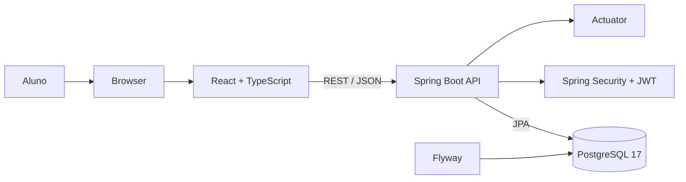
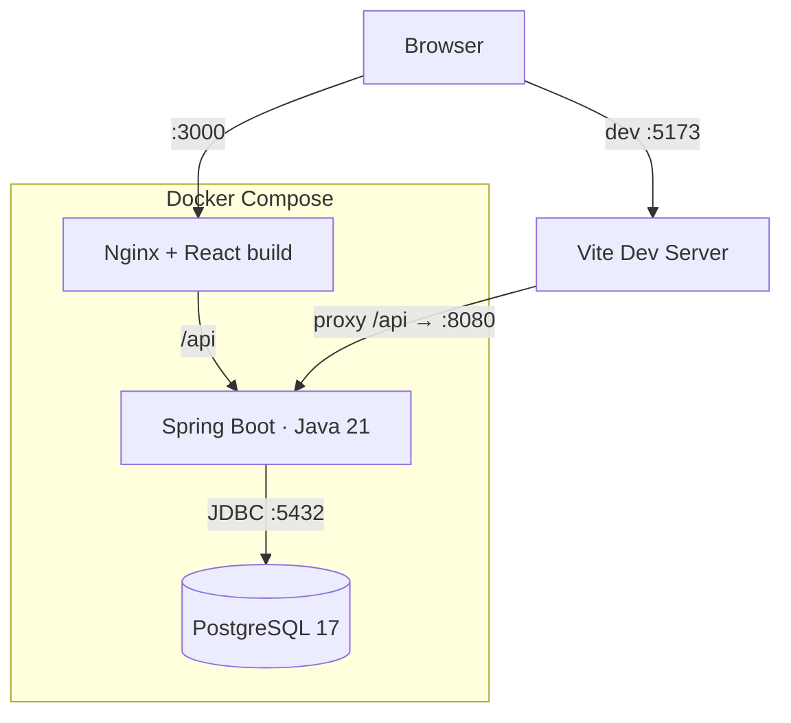
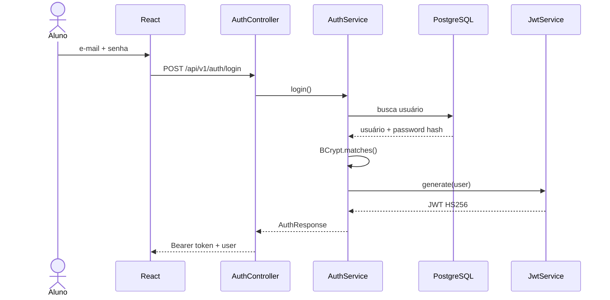
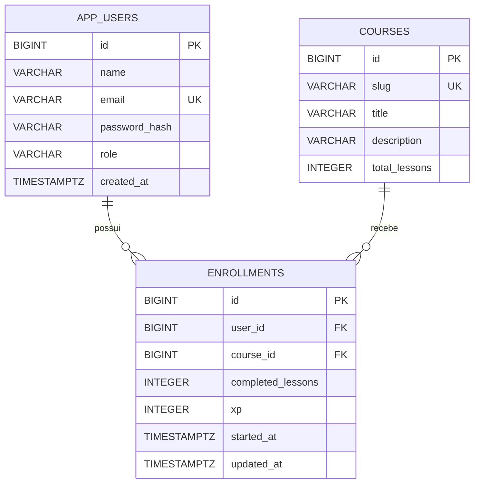
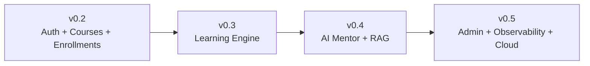

# Arquitetura — TechMind AI Academy

## 1. Visão geral

A TechMind AI Academy adota, no MVP, uma arquitetura de **monólito modular full stack**. A escolha mantém a operação simples e, ao mesmo tempo, organiza o backend por domínios que podem evoluir com baixo acoplamento.

O objetivo arquitetural atual é sustentar a jornada:

```text
Aluno → autenticação → trilha → matrícula → progresso → XP → feedback
```

## 2. Contexto do sistema



## 3. Containers



## 4. Backend por domínio

```text
br.com.techmind.academy
├── auth
├── course
├── enrollment
├── interview
├── progress
├── security
└── user
```

### auth
Responsável por cadastro, login, normalização de e-mail, hash de senha e emissão do JWT.

### security
Configura autenticação stateless, Resource Server JWT, HS256, issuer, BCrypt e CORS.

### user
Representa a identidade do aluno e seu perfil autenticado.

### course
Mantém o catálogo de trilhas de aprendizagem.

### enrollment
Relaciona aluno e trilha, armazenando aulas concluídas e XP.

### progress
Consolida indicadores de evolução do aluno.

### interview
Implementa a base de avaliação de respostas para entrevistas técnicas e prepara a futura integração com LLM.

## 5. Fluxo de autenticação



O token contém subject, id do usuário, nome e role, possui expiração configurável e issuer `techmind-ai-academy`.

## 6. Persistência



O Flyway é a fonte de verdade do schema. O Hibernate utiliza `ddl-auto: validate`, portanto valida o modelo sem alterar automaticamente a estrutura.

## 7. Segurança

Princípios atuais:

- autenticação stateless;
- BCrypt para senhas;
- JWT HS256;
- secret mínimo de 32 bytes;
- validação de issuer;
- variáveis de ambiente para credenciais;
- CORS configurável;
- endpoints privados por padrão;
- `.env` fora do versionamento.

## 8. CI

O workflow `.github/workflows/ci.yml` valida três aspectos independentes:

1. **Backend:** Java 21 + Maven + testes.
2. **Frontend:** Node 22 + `npm ci` + build TypeScript/Vite.
3. **Docker:** validação do Compose e build das imagens do backend e frontend.

O job Docker só inicia depois dos jobs de backend e frontend concluírem com sucesso.

## 9. Decisões arquiteturais

### Monólito modular antes de microsserviços
O sistema ainda não exige a complexidade operacional de múltiplos deploys, service discovery, observabilidade distribuída ou comunicação entre serviços.

### REST + JSON
É suficiente para a interação atual SPA/API e mantém baixo custo de integração.

### PostgreSQL
Adequado ao domínio relacional de usuários, cursos e matrículas, além de oferecer consistência transacional e boa evolução futura.

### Flyway
Garante histórico explícito e reprodutível de schema.

### JWT stateless
Permite escalar instâncias da API sem replicar sessão no servidor.

## 10. Evolução prevista



A migração para microsserviços só deve ocorrer quando métricas de produto, escala ou autonomia de times justificarem a separação de componentes.
